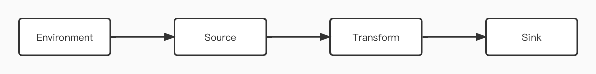
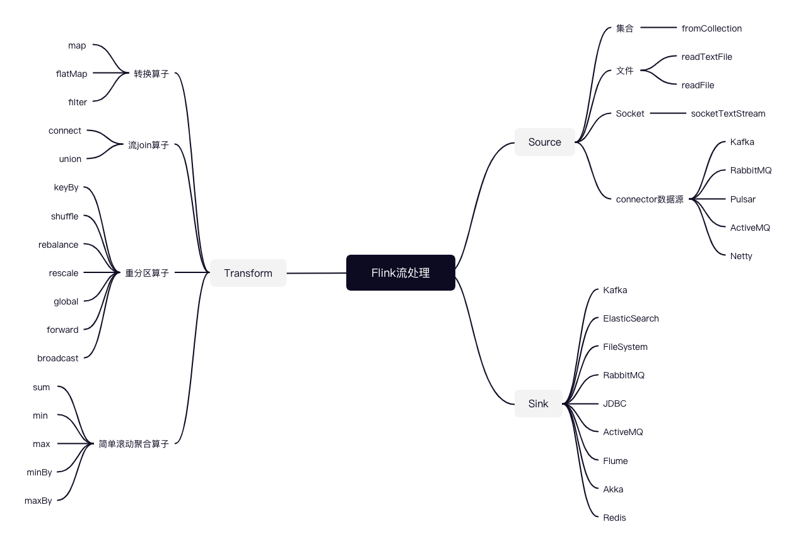

#### Flink Stream常用算子

其实对于所有的计算框架都是一样的，都分为以下四部分：



Flink中提供的一些Source、Transform算子以及Sink如下：



##### 1. Environment

Flink Job提交执行计算时，首先需要简历和Flink框架的联系，所以只有获取处理的环境，才能将task调度到不同的taskManager执行。

```java
// 批处理环境
ExecutionEnvironment benv = ExecutionEnvironment.getExecutionEnvironment();

// 流处理环境
StreamExecutionEnvironment env = StreamExecutionEnvironment.getExecutionEnvironment();
```

获取执行环境之后，有很多参数都是可选的，除过以下的一些简单参数，还有很多参数，可以参考[官网](https://nightlies.apache.org/flink/flink-docs-release-1.14/docs/dev/datastream/fault-tolerance/checkpointing/)

```java
// 设置并行度
env.setParallelism(1);
// 是否开启checkpoint，参数（checkpoint之间的间隔(ms),[checkpoint的模式：至少一次/恰好一次])
env.enableCheckpointing(6000, CheckpointingMode.EXACTLY_ONCE);
// 设置状态后端：内存/文件系统/RocksDB
env.setStateBackend(new FsStateBackend("hdfs://supercluster/flink/checkpoints"));
```

##### 2. Source

Flink框架可以从不同来源获取数据，将数据交给框架进行处理，将获取数据的来源称之为数据源，常见的数据源大致分为以下几种：

###### 1. 从集合中获取数据

```java
List<Student> students = Arrays.asList(new Student("1324", "alice", 14),
    new Student("1325", "bob", 15),
    new Student("1326", "tom", 20));
DataStreamSource<Student> studentDS = env.fromCollection(students);
```

###### 2. 从文件中读取数据

- 参数可以是目录也可以是文件
- 路径可以是相对路径也可以是绝对路径
- 相对路径是从系统属性`user.dir`获取路径；IDEA是project的根路径；`standalone`模式下是集群节点根目录
- 也可以从HDFS目录下读取，使用路径`hdfs://...`，Flink中没有hadoop相关依赖，注意引入对应的包

```java
// 读取数据
DataStreamSource<String> studentDS = env.readTextFile("hdfs://supercluster/data/flink/student.txt");

// 转换为实体类
SingleOutputStreamOperator<Student> mapDS = studentDS.map(value -> {
    String[] values = value.split(",");
    return new Student(values[0], values[1], Integer.valueOf(values[2]));
});
```

###### 3. 从Socket读取数据

```java
DataStreamSource<String> socketDS = env.socketTextStream("localhost", 9999);
```

###### 4. 从kafka中获取数据

- Flink框架提供了很多的connector连接器，在使用时需要导入对应的包

```java
Properties properties = new Properties();
properties.put(ConsumerConfig.BOOTSTRAP_SERVERS_CONFIG, "hadoop01:9092,hadoop02:9092,hadoop03:9092");
properties.put(ConsumerConfig.GROUP_ID_CONFIG, "flinktest");
// 添加数据源
DataStreamSource<String> kafkaDS = env.addSource(new FlinkKafkaConsumer<String>("flinktest",
    new SimpleStringSchema(), properties));
```

###### 5. 自定义source

- 自定义source需要实现`SourceFunction`接口

```java
public static class MySource implements SourceFunction<Student> {
    // 定义属性
    private String host;
    private Integer port;

    private Boolean running = true;

    Socket socket = null;
    BufferedReader reader = null;

    public MySource() {
    }

    public MySource(String host, Integer port) {
        this.host = host;
        this.port = port;
    }

    @Override
    public void run(SourceContext<Student> ctx) throws Exception {
        // 常见输入流
        socket = new Socket(host, port);
        reader = new BufferedReader(new InputStreamReader(socket.getInputStream(),
        StandardCharsets.UTF_8));

        // 读取数据
        String line = reader.readLine();

        while (running && line != null) {
            // 接受数据并发送至Flink系统
            String[] split = line.split(",");
            Student student = new Student(split[0], split[1], Integer.parseLong(split[2]));
            ctx.collect(student);
            line = reader.readLine();
        }
    }

    @Override
    public void cancel() {
        running = false;
        try {
            reader.close();
        } catch (IOException e) {
            e.printStackTrace();
        }
        try {
            socket.close();
        } catch (IOException e) {
            e.printStackTrace();
        }
    }
}
```

##### 3. Transform

###### 1. map

- 作用：将数据流中的数据进行转换，形成新的数据流，消费一个元素并产出一个元素
- 参数：`lambda`表达式或`MapFunction`或`RichMapFunction`的实现类
- 返回：`DataStrem -> DataStream`

```java
public class Flink09_Transform_RichMap {
    public static void main(String[] args) throws Exception {
        // 1.获取流执行环境
        StreamExecutionEnvironment env = StreamExecutionEnvironment.getExecutionEnvironment();
        // 设置并行度
        env.setParallelism(1);

        // 2.从文件中读取数据
        DataStreamSource<String> socketDS = env.socketTextStream("hadoop01", 9999);

        // 3.RichMap转换算子
        SingleOutputStreamOperator<Student> mapDS = socketDS.map(new MyRichMapFunction());

        // 4.打印
        mapDS.print();

        // 5.提交
        env.execute();
    }

    // RichFunction富有的地方在于①有生命周期方法；②可以获取上下文执行环境，做状态编程
    public static class MyRichMapFunction extends RichMapFunction<String, Student> {
        @Override
        public Student map(String value) throws Exception {
            String[] split = value.split(",");
            return new Student(split[0], split[1], Integer.parseInt(split[2]));
        }

        @Override
        public void open(Configuration parameters) throws Exception {
            System.out.println("Open 方法被调用！！！");
        }

        @Override
        public void close() throws Exception {
            System.out.println("Close 方法被调用！！！");
        }
    }
}
```

###### 2. flatMap

- 作用：消费一个元素并产生零个或多个元素
- 参数：`FlatMapFunction`或`RichFlatMapFunction`实现类
- 返回：`DataStream -> DataStream`

```java
SingleOutputStreamOperator<String> flatMapDS = socketDS.flatMap(new FlatMapFunction<String, String>() {
    @Override
    public void flatMap(String value, Collector<String> out) throws Exception {
        String[] strings = value.split(" ");
        for (String string : strings) {
            out.collect(string);
        }
    }
});
```

###### 3. filter

- 作用：根据指定的规则将满足条件的数据保留，不满足条件的数据丢弃
- 参数：`FilterFunction`或`RichFilterFunction`的实现类
- 返回：`DataStream -> DataStream`

```java
SingleOutputStreamOperator<String> filterDS = textFile.filter(new RichFilterFunction<String>() {
    @Override
    public void open(Configuration parameters) throws Exception {
        System.out.println("Open 方法被调用！！！");
    }

    @Override
    public boolean filter(String value) throws Exception {
        String[] strings = value.split(",");
        return Integer.parseInt(strings[2]) > 30;
    }

    @Override
    public void close() throws Exception {
        System.out.println("Close 方法被调用！！！");
    }
});
```

###### 4. keyBy

- 作用：把流中的数据分到不同的分区中，具有相同key的元素会分到同一个分区中，一个分区中可以有多重不同的key，在内部时使用hash分区来实现的
- 参数：`KeySelector<IN, KEY>`的实现类
- 返回：`DataStream -> KeyedStream`

```java
// 根据年龄不同分为几组
// 需要注意的是如果根据POJO进行分类，需要重写hashCode方法，不能使用Object的hashCode，这样的分组没有意义
studentDs.keyBy(student -> student.getAge())
```

###### 5. shuffle

- 作用：把流中的元素随机打乱，对同一个组的数据，每次得到的结果都不相同
- 参数：无
- 返回：`DataStream -> DataStream`

```java
studentDS.shuffle()
```

###### 6. rebalance

- 作用：将数据随机打乱写入下游分区，随机第一个分区，之后开始轮询。如果上游是8个分区，下游4个分区，会将8个分区的数据随机写入下游4个分区
- 参数：无
- 返回：`DataStream -> DataStream`

```java
studentDS.rebalance()
```

###### 7. rescale

- 作用：将数据随机打乱写入下游分区，随机第一个分区，之后开始轮询。如果上游是8个分区，下游4个分区，会根据情况将前4个分区的数据写入下游其中2个分区，剩下4个分区的数据写入其他两个分区
- 参数：无
- 返回：`DataStream -> DataStream`

```java
studentDS.rescale()
```

###### 8. glocal

- 作用：将所有数据统一写入一个分区
- 参数：无
- 返回：`DataStream -> DataStream`

```java
studentDS.global()
```

###### 9. forward

- 作用：上下游并行度相同时使用，分区一一对应，如果上下游分区不同则会报错
- 参数：无
- 返回：`DataStream -> DataStream`

```java
studentDS.forward()
```

###### 10. 简单滚动聚合算子

- 包含`sum`、`min`、`max`、`minBy`和`maxBy`等聚合算子

- 作用：keyedStream的每一个支流做聚合，执行完成后，会将聚合的结果合成一个流返回，所以结果都是DataStream
- 参数：如果流中存储的POJO或者Scala的样例类，直接使用参数名；如果是元组则参数就是位置
- 返回：`KeyedStream -> SingleOutputStreamOperator`

```java
SingleOutputStreamOperator<Student> maxStream = keyedStream.max("age");
```

###### 11. connect

- 作用：将两个不同来源的流进行连接，实现数据匹配。Flink中的connect算子可以连接两个保持它们类型的数据流，两个数据流被connect之后，只是被放在了同一个流中，内部依然保持各自的数据和形式不发生任何变化，两个流相互独立
- 参数：另外一个流
- 返回：`DataStream[A], DataStream[B] -> ConnectedStreams[A, B]`

```java
DataStreamSource<Integer> intStream = env.fromElements(1, 2, 3, 4, 5);
DataStreamSource<String> stringStream = env.fromElements("a", "b", "c");
// 把两个流连接在一起: 貌合神离
ConnectedStreams<Integer, String> cs = intStream.connect(stringStream);
cs.getFirstInput().print("first");
cs.getSecondInput().print("second");
```

###### 12. union

- 作用：对两个或两个以上的DataStream进行union操作，产生一个包含所有DataStream元素的新DataStream
- 参数：另外的流
- 返回：`DataStream -> DataStream`

```java
DataStreamSource<Integer> stream1 = env.fromElements(1, 2, 3, 4, 5);
DataStreamSource<Integer> stream2 = env.fromElements(10, 20, 30, 40, 50);
DataStreamSource<Integer> stream3 = env.fromElements(100, 200, 300, 400, 500);

// 把多个流union在一起成为一个流, 这些流中存储的数据类型必须一样: 水乳交融
stream1
    .union(stream2)
    .union(stream3)
    .print();
```

##### 4. Sink

###### 1. KafkaSink

```java
Properties properties = new Properties();
properties.put(ProducerConfig.BOOTSTRAP_SERVERS_CONFIG, "hadoop01:9092,hadoop02:9092,hadoop03:9092");

studentDS.map(new MapFunction<Student, String>() {
    @Override
    public String map(Student value) throws Exception {
        return JSON.toJSONString(value);
    }
}).addSink(new FlinkKafkaProducer<String>("test", new SimpleStringSchema(), properties));
```

###### 2. RedisSink

```java
FlinkJedisPoolConfig jedisPoolConfig = new FlinkJedisPoolConfig.Builder()
    .setHost("hadoop01")
    .setPort(6379)
    .build();

studentDS.addSink(new RedisSink<>(jedisPoolConfig, new RedisMapper<Student>() {
    @Override
    public RedisCommandDescription getCommandDescription() {
        return new RedisCommandDescription(RedisCommand.HSET, "Student");
    }

    @Override
    public String getKeyFromData(Student data) {
        return data.getUserId();
    }

    @Override
    public String getValueFromData(Student data) {
        return data.getName();
    }
}));
```

###### 3. ElasticSearchSink

```java
ArrayList<HttpHost> httpHosts = new ArrayList<>();
httpHosts.add(new HttpHost("hadoop01", 9200));
httpHosts.add(new HttpHost("hadoop02", 9200));
httpHosts.add(new HttpHost("hadoop03", 9200));

ElasticsearchSink.Builder<Student> studentBuilder = new ElasticsearchSink.Builder<Student>(httpHosts, new ElasticsearchSinkFunction<Student>() {
    @Override
    public void process(Student data, RuntimeContext runtimeContext, RequestIndexer requestIndexer) {
        HashMap<String, Integer> source = new HashMap<>();
        source.put("name", data.getName().toString());
        source.put("age", data.getAge());

        // 创建Index请求
        IndexRequest student = Requests.indexRequest()
            .index("student")
            .id(data.getUserId())
            .source(source);

        // 写入ES
        requestIndexer.add(student);
    }
});
// 批量提交参数
studentBuilder.setBulkFlushMaxActions(1);
ElasticsearchSink<Student> elasticsearchSink = studentBuilder.build();

studentDS.addSink(elasticsearchSink);
```

###### 4. 自定义sink

- 自定义sink需要实现`RichSinkFunction`接口

```java
sensorDS.addSink(new RichSinkFunction<Student>() {
    // 声明连接
    private Connection connection;
    private PreparedStatement preparedStatement;

    @Override
    public void open(Configuration parameters) throws Exception {
        // Class.forName("oracle.jdbc.OracleDriver");
        connection = DriverManager.getConnection("jdbc:oracle:thin:@localhost:1521:xe", "yankee", "xiaoer");
        preparedStatement = connection.prepareStatement("merge into student a using (select ? as id from dual) b on (a.userId = b.userId) when matched then update set a.name = ?, a.age = ? when not matched then insert values (?, ?, ?)");
        log.info("连接创建完成！");
    }

    @Override
    public void invoke(WaterSensor_Java value, Context context) throws Exception {
        // 赋值
        preparedStatement.setString(1, value.getUserId());
        preparedStatement.setLong(2, value.getName());
        preparedStatement.setInt(3, value.getAge());
        preparedStatement.setString(4, value.getUserId());
        preparedStatement.setLong(5, value.getName());
        preparedStatement.setInt(6, value.getAge());

        // 执行操作
        preparedStatement.execute();
    }

    @Override
    public void close() throws Exception {
        preparedStatement.close();
        connection.close();
        log.info("连接关闭完成！");
    }
});
```

##### 5. 执行模式

Flink引入了三种模式，分别是：`STREAMING(默认)`、`BATCH`和`AUTOMATIC`。`STREAMING`是流处理模式，即所谓的无界流，当然也可以用来处理有界流，对于数据是来一条处理一条。`BATCH`是批处理模式，可以用来处理有界流数据，对于数据处理完之后，一次性输出结果。`AUTOMATIC`是自动根据Source进行设置`STREAMING`还是`BATCH`。

- 通过命令行配置

  ```shell
  $ bin/flink run -Dexecution.runtime-mode=STREAMING
  ```

- 通过代码配置

  ```java
  env.setRuntimeMode(RuntimeExecutionMode.AUTOMATIC);
  ```

建议配置执行模式时在提交作业的命令行中配置，这样对于一个作业来说更加灵活。