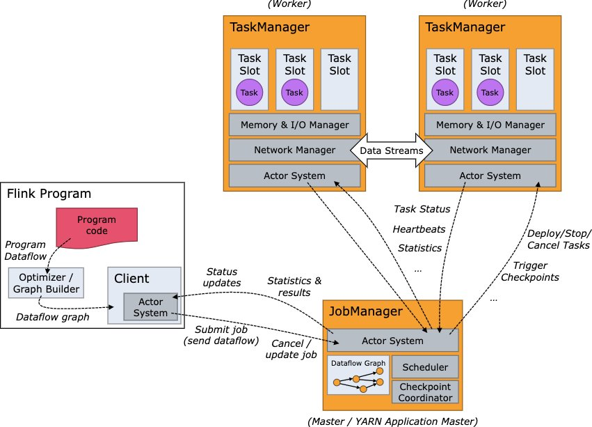
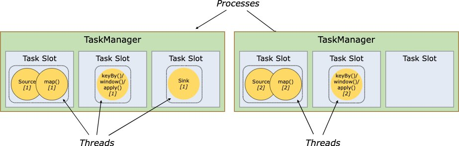
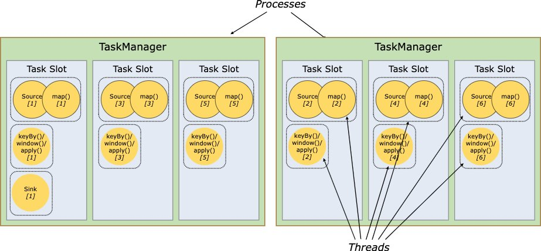
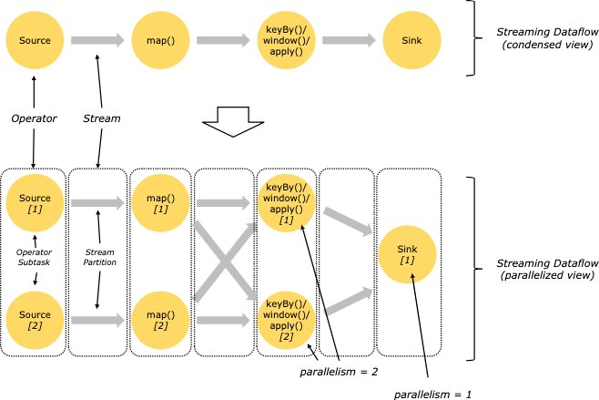
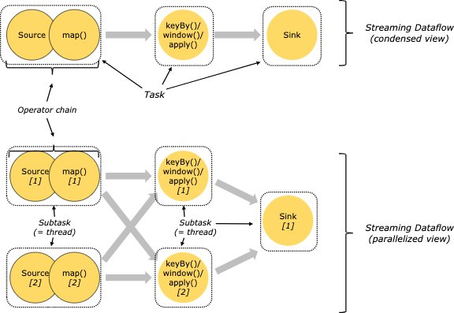
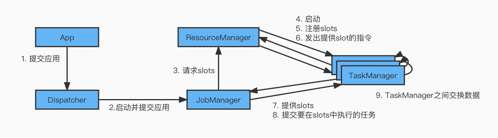
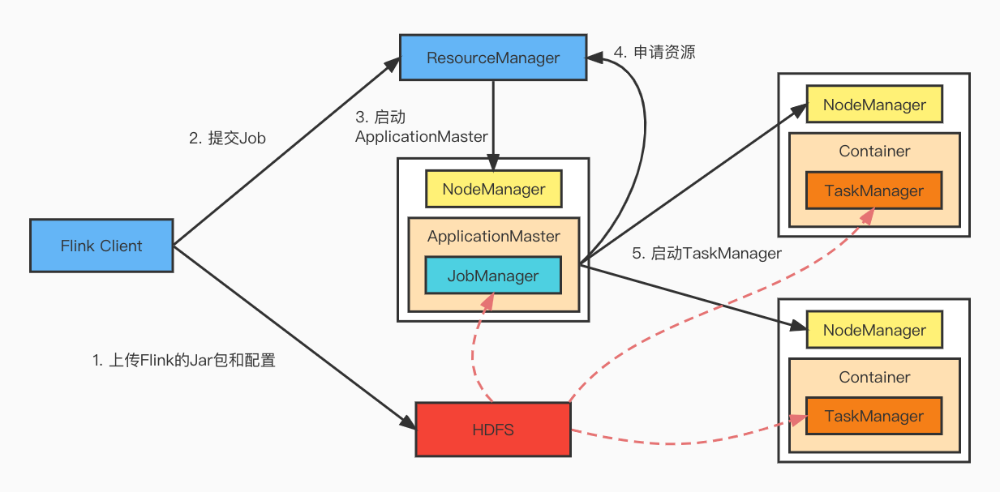

#### Flink的运行架构

##### 1. 运行架构

###### 1. Client

严格意义上说，Client不是运行和程序执行的一部分，而是用于准备dataflow并将其发送给JobManager。之后，Client可以断开连接与JobManager的连接（分离模式-detached mode），也可以继续保持与JobManager的连接（附加模式-attached mode）。

客户端可以作为触发执行Java或Scala代码的一部分运行，也可以在命令行进程`bin/flink run ...`中运行。

###### 2. JobManager

JobManager是控制一个应用程序执行的主进程，也就说，每个应用程序都会被一个不同的JobManager所控制执行。

JobManager会先接收到要执行的应用程序，这个应用程序会包括：作业图（JobGraph）、逻辑数据流图（logical dataflow graph）和打包了所有的类、库和其他资源的JAR包。

JobManager会把JobGraph转换成一个物理层面的数据流图—执行图（ExecutionGraph），包含了所有可以并发执行的任务，JobManager会向资源管理器（ResourceManager）请求执行任务必要的资源，也就是任务管理器（TaskManager）上的插槽（slot），一旦获取到了足够的资源，就会将执行图分发到真正运行它们的TaskManager上。

而在运行过程中，它决定何时调度下一个task（或一组 task）、对完成的task 或执行失败做出反应、协调checkpoint、并且协调从失败中恢复等等。这个进程由三个不同的组件组成：

- ResourceManager

  ResourceManager负责Flink集群中的资源提供、回收、分配，它管理的是slots，slot是Flink集群中资源调度的单位。Flink为不同的环境和资源提供者实现了对应的ResourceManager。

  当JobManager申请slot资源时，ResourceManager会将空闲插槽的TaskManager分配给JobManager，如果ResourceManager没有足够的插槽来满足JobManager的请求，它还可以向资源提供平台发起会话，以提供启动TaskManager进程的容器，另外ResourceManager还负责终止空闲的TaskManager，释放计算资源。

- Dispatcher

  负责接收用户提供的作业，并且负责为这个新提交的作业启动一个新的JobManager组件。Dispatcher也会启动一个Web  UI，用来方便地展示和监控作业执行的信息，Dispatcher在架构中可能并不是必需的，这取决于应用提交运行的方式。

- JobMaster

  JobMaster负责单个JobGraph的执行，多个Job可以同时运行在一个Flink集群中，每个Job都有一个自己的JobMaster。

###### 3. TaskManager

Flink中的工作进程，通常在Flink中会有多个TaskManager运行，每一个TaskManager都包含了一定数量的插槽（slot），插槽的数量限制了TaskManager能够执行的任务数量。

启动任务后，TaskManager会向资源管理器注册它的插槽，收到资源管理器的指令后，TaskManager就会将一个或者多个插槽提供给JobManager调用，JobManager就可以向插槽分配任务（tasks）来执行了。

在执行过程中，一个TaskManager可以跟其他运行同一个应用程序的TaskManager交换数据。

##### 2. 核心概念

###### 1. TaskManager与Slots

Flink中每一个worker(TaskManager)都是一个JVM进程，它可能会在独立的线程上执行一个Task，为了控制一个worker能接收多少个task，worker通过Task Slot来进行控制（一个worker至少有一个Task slot）。

每个task slot表示TaskManager拥有资源的一个固定大小的子集，假如一个TaskManager有三个slot，那么它会将其管理的内存分成三份给各自的slot，资源slot化意味着一个task将不需要跟来自其他job的task竞争被管理的内存，取而代之的是它将拥有一个一定数量的内存存储，需要注意的是，slot不会涉及到CPU的隔离，slot目前仅仅用来隔离task的受管理的内存。

通过调整task slot的数量，用户可以自定义subTask如何互相隔离。每个TaskManager有一个slot，这就意味着每个task组都在单独的JVM中运行。具有多个slot意味着更多的subtask共享一个JVM。同一JVM中的task共享TCP连接（通过多路复用）和心跳信息，它们还可以共享数据集和数据结构，从而减少了每个task的开销。

默认情况下，Flink允许subtask共享slot，即便它们是不同的task的subtask，只要是来自于同一个作业即可。结果就是一个slot可以持有整个管道的作业。允许slot共享有两个主要优点：

- Flink集群所需要的task slot和作业中使用的最大并行度恰好一样。无需计算程序总共包含多少个task（具有不同的并行度）。
- 容易获得更好的资源利用。如果没有slot共享，非密集subtask（source/map()）将阻塞和密集型subtask（window）一样多的资源。通过slot共享，可以充分利用分配的资源，同时确保繁重的subtask在TaskManager之间公平分配。

###### 2. Parallelism（并行度）

一个特定算子的子任务（subtask）的个数被称之为这个算子的并行度（parallelism），一般情况下，一个流程序的并行度，可以认为就是其所有算子中最大的并行度，一个程序中，不同的算子可能具有不同的并行度。

Stream在算子之间传输数据的形式可以是one-to-one（forwarding）的模式也可以是redistributing的模式，具体是哪一种形式，取决于算子的种类。

- One-to-one

  Stream维护着分区以及元素的顺序，那意味着flatMap算子的子任务看到的元素的个数以及顺序跟source算子的子任务产生的元素的个数、顺序相同，map、filter、flatMap等算子都是one-to-one的对应关系。

- Redistributing

  Stream（map()跟keyBy/window之间或者keyBy/window跟sink之间）的分区会发生改变，每一个算子的子任务依据所选择的transformation发送数据到不同的目标任务，例如keyBy()基于hashCode重分区、broadcast和rebalance会随机重新分区，这些算子都会引起redistribute过程。

###### 3. Task和subTask

一个算子就是一个Task，一个算子的并行度是n，那这个Task就有n个subTask。

###### 4. Operator Chains（任务链）

相同并行度的one-to-one操作，Flink将这样相连的算子链接在一起形成一个task，原来的算子成为里面的一部分，每个task被一个线程执行。

将算子链接成task是非常有效的优化 ，它能减少线程之间的切换和基于缓存区的数据交换，在减少时延的同时提升吞吐量，链接的行为可以在Flink StreamAPI中进行指定。

###### 5. Flink中的四种Graph

由Flink程序直接映射成的数据流图是StreamGraph，也被称之为逻辑流图，因为它们表示的是计算逻辑的高级视图，为了执行一个流处理程序，Flink需要将逻辑流图转换为物理流图（也叫执行图）。

Flink中的执行图可以分为四层：StreamGraph -> JobGraph -> ExecutionGraph -> PhysicalGraph。

其中StreamGraph和JobGraph是由Client生成的，ExecutionGraph是JobManager接收到Client提交的JobGraph及其依赖Jar后进行进一步并行化、可调度的执行图，这个图是由JobMaster做的。PhysicalGraph是真正调度到TaskManager上的一种运行图，它没有具体对应的类。

- StreamGraph

  是根据用户通过Stream API编写的代码生成的最初的图，用来表示程序的拓扑结构。可以在代码中使用`env.getExecutionPlan()`将生成的json复制到[flink官网中](https://flink.apache.org/visualizer/)查看。

- JobGraph

  StreamGraph经过优化后生成了JobGraph，提交给JobManager的数据结构，主要的优化是：将多个符合条件的节点chain在一起作为一个节点，这样可以减少数据在节点之间流动所需要的序列化/反序列化/传输消耗。

- ExecutionGraph

  JobManager根据JobGraph生成ExecutionGraph。ExecutionGraph是JobGraph的并行化版本，是调度层最核心的数据结构。

- PhysicalGraph

  JobManager根据ExecutionGraph对Job进行调度后，在各个TaskManager上部署Task后形成的“图”，并不是一个具体的数据结构。

下面附一张Jark大神博客的图，更多细节可见参考部分给的他的文章：

##### 3. 提交流程

###### 1. 通用提交流程

###### 2. Yarn-cluster提交流程per-job

- Flink任务提交后，Client向HDFS上传Flink的Jar包和配置
- 向Yarn ResourceManager提交任务，ResourceManager分配Container资源
- 通知对应的NodeManager启动ApplicationMaster，ApplicationMaster启动后加载Flink的Jar包和配置构建环境，然后启动JobManager
- ApplicationMaster向ResourceManager申请资源启动TaskManager
- ResourceManager分配Container资源后，由ApplicationMaster通知资源所在节点的NodeManager启动TaskManager
- NodeManager加载Flink的Jar包和配置构建环境并启动TaskManager
- TaskManager启动后向JobManager发送心跳包，并等待JobManager向其分配任务